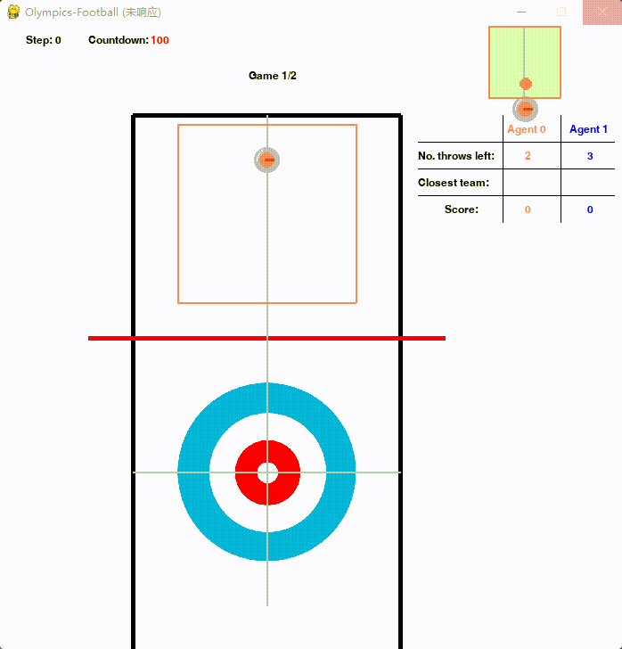

  
# Competition_IJCAI2023

source code for IJCAI 2023 Competition


## Multi-Agent Game Evaluation Platform --- Jidi (及第)
Jidi supports online evaluation service for various games/simulators/environments/testbeds. Website: [www.jidiai.cn](www.jidiai.cn).

A tutorial on Jidi: [Tutorial](https://github.com/jidiai/ai_lib/blob/master/assets/Jidi%20tutorial.pdf)


## Environment




Check details in Jidi Competition [IJCAI 2023 AI Qlympics Competition](http://www.jidiai.cn/compete_detail?compete=34) 


### Olympics-Integrated
<b>Tags</b>: Partial Observation; Continuous Action Space; Continuous Observation Space, Multi-Tasks

<b>Introduction: </b>Agents participate in the Olympic Games. In this series of competitions, two agents participate in **Six** Olympics games, including **running, football, table hockey, wrestling, curling and billiard**.

<b>Environment Rules:</b> 
1. This game has two sides and both sides control an elastic ball agent with the same mass and radius.
2. Agents can collide with each other or walls, but they might lose a certain speed. The agent has its own energy, and the energy consumed in each step is directly proportional to the applied driving force and displacement.
3. The energy of the agent recovers at a fixed rate at the same time. If the energy decays to zero, the agent will be tired, resulting in failure to apply force.
4. The whole game contains the subgames below. In running, the goal is to reach the end as fast as possible. In football, agent needs to hit the ball through collision into opponent's goal and defend his own goal. In table-hockey, agents share the same objective as in football except that they can only move freely in our own half court. In wrestling, agent who knock others out of bounds while keeping staying in bounds wins the game.
5. The game ends when all subgames are finished.


<b>Action Space: </b>Continuous, a matrix with shape 2*1, representing applied force and steering angle respectively.

<b>Observation: </b>A dictionary with keys 'obs' and 'controlled_player_index'. The value of 'obs' contains a 2D matrix with shape of 40x40 and other game-releated infomation. The 2D matrix records the view of agent along his current direction. Agent can see walls, marking lines, opponents and other game object within the vision area. The value of 'controlled_player_index' is the player id of the game. The side information includes energy left and a game-switching flags.

<b>Reward: </b>Each team obtains a +1 reward when winning a subgame, and 0 reward when losing a subgame.

<b>Environment ends condition: </b>The game ends when all subgames are finished.

<b>Registration: </b>Go to (http://www.jidiai.cn/compete_detail?compete=17 and http://www.jidiai.cn/compete_detail?compete=18).

---
## Navigation

```
|-- Competition_IJCAI2023                   // https://github.com/jidiai/Competition_IJCAI2023.git 
	|-- agents                          // Agents that act in the environment
	|	|-- random                  // A random agent demo
	|	|	|-- submission.py   // A ready-to-submit random agent file
	|-- env		                    // scripts for the environment
	|	|-- config.py               // environment configuration file
	|	|-- olympics_integrated.py  // The environment wrapper	
	|-- olympics_engine		    // Game engine (https://github.com/jidiai/olympics_engine)
	|-- rl_trainer                      // A training example of some of the sub-scenarios (for reference only)
	|-- utils               
	|-- run_log.py		            // run the game with provided agents (same way we evaluate your submission in the backend server)
```


---
## Dependency

>conda create -n olympics python=3.8.5

>conda activate olympics

>pip install -r requirements.txt

---

## Run a game

>python olympics_engine/main.py

---

## How to test submission

You can locally test your submission. At Jidi platform, we evaluate your submission as same as *run_log.py*

For example,

>python run_log.py --my_ai "random" --opponent "random"

in which you are controlling agent 1 (light red)

---

## Ready to submit

Random policy --> *agents/random/submission.py*


## Frequently asked question:
- Q: Any requirement on the submitted agents?
- A: The submitted agent will be run on CPU-only machine and the decision time needs to be within 1 second 
and takes memory no more than 500M. The submitted file must contain a `submission.py` script that has 
a `my_controller(*)` function in it (See the random agent demo). We will call this function to generate action in our evaluation backend.

- Q: Any requirement on agent training?
- A: We add no restriction to agent training. You can solve the tasks with any method you like, e.g. rule-based, heuristic, RL, etc.
